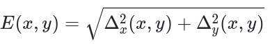
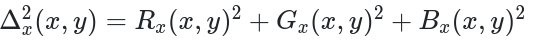
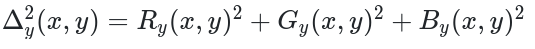
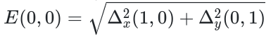

# Calculating Pixel Intensity
## Pixel Energy and Intensity Calculation
### Input original image and output the image after function calculation


In order to calculate the energy and intensity values of each pixel in an image, each pixel's RGB value must be calculated separately with an algorithm/function originally developed by Shai Avidan and Ariel Shamir. 

By energy, one calculates the importance of pixels when resizing an image with Seam Carving.

The dual-gradient energy function is:



The square of x is calculated by:



and y is:



Borders are calculated with:



For instance, if x = 0 and y = 0, "left" would be x, "right" would be x + 2, "up" would be y and "down" would be y + 2. Everything should be calculated with Double precision, until the final calculation for pixel intensity:

``` I = (255.0 * energy / maxEnergy).toInt()```

where "maxEnergy" is the largest Energy value in the entire image. 

The project uses javax.ImageIO and java.awt libraries, using methods such as "Color" in order to return an RGB value which can then easily be converted to individual Red - Green and Blue values. This simplifies matters greatly, but the project is still fairly complicated.

Compile with:

```kotlinc main.kt conditionals.kt -include-runtime -d test.jar```

Run with command line arguments, i.e.:

```java -jar test.jar -in ~/Desktop/small.png -out small-energy.png```
